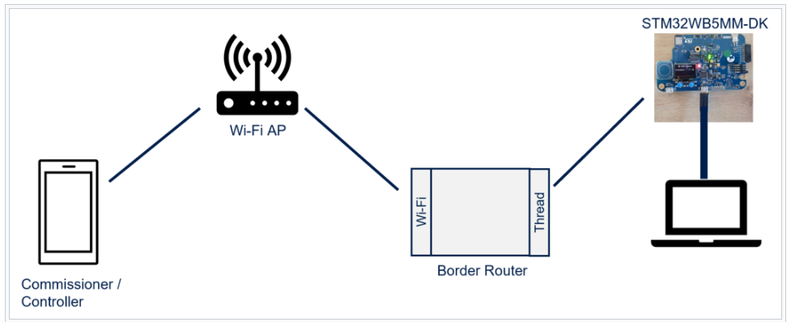
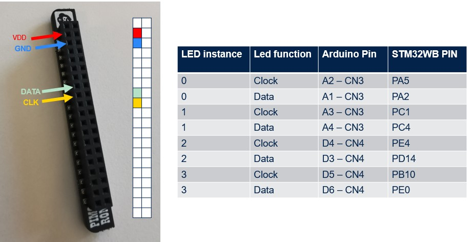
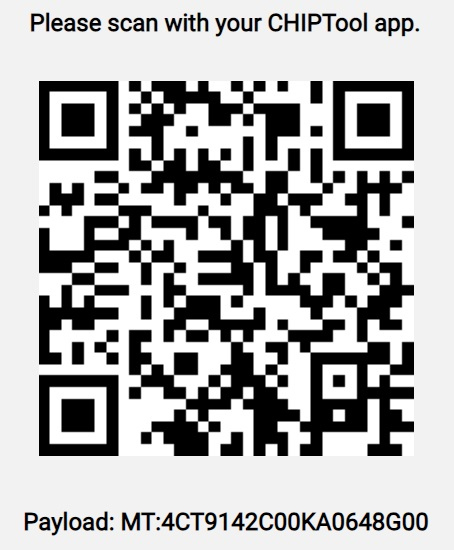
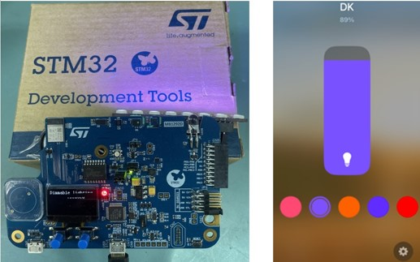

# STM32WB Matter Lighting Color Control 

## Overview

This application is based on the X-Cube-Matter firmware package which demonstrates how to remotely control a light bulb that is simulated using the LEDs from the expansion board.
The color control to includes transforming HSV (Hue, Saturation and Value), CT (Color Temperature) and XYZ color space inputs into RGB with level control.

### Keywords

MATTER, CHIP, Connectedhomeip, IoT, Internet of Things, Network, Connectivity, FreeRTOS, LwIP, commissioning, CSA, Connectivity Standards Alliance,
STM32 , STM32WB5MM-DK , OpenThread, BLE.

## Boards Needed

   The Matter network is composed of the following elements

* 1 x [STM32WB5MM-DK](https://www.st.com/en/evaluation-tools/stm32wb5mm-dk.html) board as the end device
* 1 x OpenThread Border Router
* 1 x Smartphone with an ecosystem application installed as a Matter commissioner/controller device
* At least one [RGB LED bar](<https://shop.pimoroni.com/products/blinkt?variant=22408658695>)

## Hardware configuration

* STM32WB5MM-DK Discovery kit : Jumper JP2 to 1-2 and USB STLINK to be used
* Led Bar Setup : The Led instance indicates the order of the LED bars, up to 4 bars in the project.

  

## Firmware requirements

The STM32WB5MM-DK is a complete development platform, based on Arm® Cortex®-M4 and Arm® Cortex®-M0+ cores.
These examples are based on BLE and Thread protocol working in concurrent mode.

See the process to load the wireless stack [here](https://wiki.st.com/stm32mcu/wiki/Connectivity:STM32WB_BLE_Hardware_Setup).

To make the program work, you must do the following:

* Open STM32CubeIDE toolchain version >= 1.14.0 is required.
* Build the application and load your image.
* Flash the application with [STM32CubeProgrammer](https://www.st.com/en/development-tools/stm32cubeprog.html) version >= 2.9.0
    at address 0x08000000.
* The STM32WB5MM-DK platform is used as any other Matter device with the following QR code

    

## Setting up the environment

In a Matter ecosystem with an end device over Thread , an OTBR is required. To connect the STM32WB5MM-DK to those ecosystems and perform a demonstration, follow the guide provided for each ecosystem.  

* Apple ecosystem
    The Apple ecosystem is created with an Apple HomePod Mini (with 16.1 or higher system version) as the border router, and an Apple iPhone (with iOS 16.1 or higher system version) with the Apple Home application (or any application that supports the Matter smart home standard) as the commissioner and controller. For a demonstration of the STM32WB5MM-DK with an Apple ecosystem, follow this [link](https://support.apple.com/en-us/102135).

* Google ecosystem
    The Google ecosystem is created with a Google Nest Hub 2nd-gen as the border router, and an Android device with the Google Home Application (GHA) as the commissioner and controller. For a demonstration of the STM32WB5MM-DK with a Google ecosystem, follow this [link](https://developers.home.google.com/matter/integration/pair#bouffalo-lab).

* Amazon ecosystem
    The Amazon ecosystem is created with an Amazon Echo Hub as the border router, and an Alexa application as the commissioner and controller on an Android or iOS device. For a demonstration of the STM32WB5MM-DK with an Amazon ecosystem, follow this [link](https://www.amazon.com/gp/help/customer/display.html?nodeId=TSWevY1sX8ADH2LC20).
    During the commissioning phase, Alexa (the controller) instructs the device to discover the surrounding Thread networks. The available list of Thread networks is sent to Alexa and displayed on the phone screen. The user is then invited to select one. If the selected network is known by Alexa, the commissioning will continue, otherwise Alexa will ask for the network key.
    Note that Alexa checks the serial number during the device commissioning. Therefore, when several STM32WB5MM-DK kits are used in a demonstration, it is necessary to modify the serial number, as described in [Serial number modification](https://wiki.st.com/stm32mcu/wiki/Connectivity:Matter_develop_and_prototype#Serial_number_modification), to differentiate the different kits.

* Samsung  ecosystem
    The Samsung ecosystem is created with a SmartThings Station as the border router, and an Android device with the SmartThings Application, or an iOS device running iOS 16.2 or higher and SmartThings Application version 1.6.94 or higher as the commissioner and controller. For a demonstration of the STM32WB5MM-DK with a Samsung ecosystem, follow this [link](https://support.smartthings.com/hc/en-us/articles/11219700390804-SmartThings-x-Matter-Integration#h_01GK308T7W6SXFPX5KVP4XM85K).

### How to use

1. Enable Bluetooth and Location services on your smartphone.
2. Connect the smartphone to your Wi-Fi Access Point.
3. Open the application on your smartphone.
4. Tap the following buttons and scan the commissioning QR code
5. When commissioning is complete, you have a bar to change the level of the power of the light and a  button to change the colors.

In this example, to commission the device onto a Matter network, it must be
discoverable over Bluetooth LE. After powering up the device, the device will advertise
automatically for 30 seconds. After this delay, you will need to reset the device to start
the commissioning procedure.

If you need to proceed with a new commissioning after a commissioning succeeds, factory reset the device by pressing the button B1 for at least 10 seconds and then perform a hardware reset. After this step, the commissioning process of the device can start.

## Known issues

* Due to some mDNS issues, the commissioning with some Wi-Fi access point may fail.

* The upstream application build is supported on Windows, MacOS and Linux. However, the package itself has only been tested on a Windows 10 host.

## Troubleshooting

**Caution** :

* OTA is currently not supported by ST
* The Android application has only been tested on arm64 smartphone CPU architecture

**For any other question** related to the product, the hardware performance or characteristics, the tools, the environment, you can submit it to the **ST Community** on the STM32 MCUs related [page](https://community.st.com/s/topic/0TO0X000000BSqSWAW/stm32-mcus).
